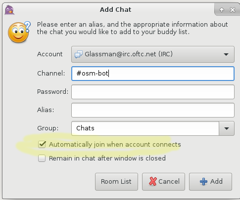

# New Users

This script searches for new users and notres from the IRC channel #osm_bot on irc.oftc.net. The script checks the channel once an hour, mailing notifications when either are found. 

#### Requirements
-  linux
-  pidgin
-  mailx

#### Usage
-  Configure pidgin to be started automatically when you log in. In pidgin preference, set logging to **plain text** and to automatically  the #osm-bot channel. 
-  Configure mailx to send emails. If you don't know how to configure mailx, you'll need to search for help. With all of the different email systems, it's beyond the scope of this simple how-to. 
-  Modify [search_purple.sh](search_purple.sh) for your email, path and search string.
-  Add search_purple.sh to crontab.
```
crontab-e
01 * * * * /home/user/bin/search_purple.sh > /dev/null 2>&1
```
-  Customize the [Welcome](WelcomeMessage.md) for your geographical area.
